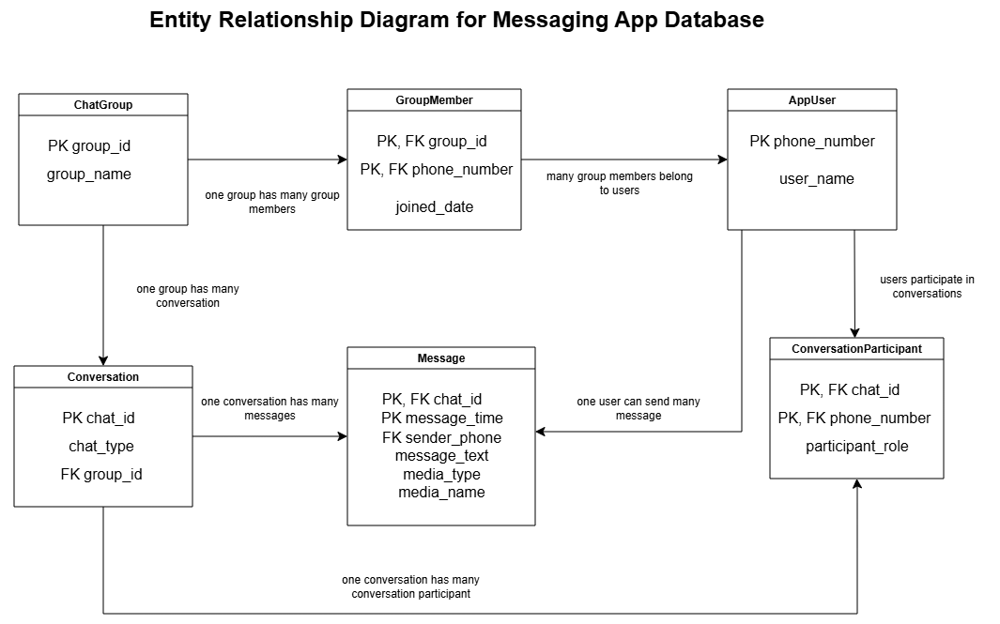

# Messaging App Relational Database Design

## Overview
This project designs and implements a relational database for a messaging application. It demonstrates how unstructured flat-file message data can be transformed into a structured relational database using normalisation and SQL.

## Business Problem
Messaging applications generate repeated data when user details, group information, message content, and media metadata are stored in a single flat file. This can lead to data redundancy, update anomalies, and inconsistent records.

## Database Solution
This project applies relational database design principles to separate users, conversations, groups, group membership, and messages into structured tables. The final design reduces redundancy, improves data integrity, and supports SQL-based message retrieval and reporting.

## Database Diagram

## Key Features
- Designed a relational database schema for a messaging application
- Normalised flat-file data into 3NF
- Created SQL DDL scripts for table creation
- Inserted sample data using SQL DML
- Wrote SQL queries for message retrieval and reporting
- Created a SQL view for group conversations containing media attachments
- Demonstrated schema evolution by adding a group member join date

## Database Tables
The database includes the following main tables:

- AppUser
- ChatGroup
- Conversation
- GroupMember
- Message
- ConversationParticipant

## Skills Demonstrated
- Relational database design
- Functional dependency analysis
- Database normalisation
- Primary key and foreign key design
- SQL DDL and DML
- SQL joins and views
- Data integrity and schema documentation

## Key Features

- Designed a relational database schema for a messaging application
- Normalised flat-file data into 3NF
- Created SQL DDL scripts for table creation
- Inserted sample data using SQL DML
- Wrote SQL queries for message retrieval and reporting
- Created a SQL view for group conversations containing media attachments
- Demonstrated schema evolution through account status, soft deletion, read receipts, message reactions, and indexing.

## Documentation

- [Business Rules](docs/business-rules.md)
- [Normalisation Summary](docs/normalisation-summary.md)
